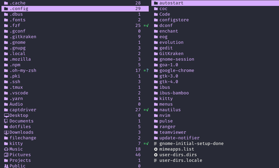
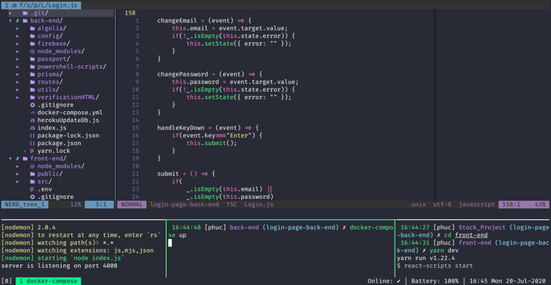

# dotfiles
A set of `vim`, `zsh`, `tmux`, `kitty` and `ranger` configuration files for Developer who likes to use Vim/NeoVim on Ubuntu.

Install
-------

Clone onto your machine:

    git clone git://github.com/HuynhHoangPhuc/dotfiles.git

Simply run file (maybe you  must run `chmod +x install.sh` before run that file):

    ./install.sh
    
Only terminal settings (maybe you must run `chmod +x terminal.sh` before run that file):
    
    ./terminal.sh
    
Only vim settings (mayber you must install `neovim`, `python3-venv`, `clangd` and run `chmod +x vim.sh` before run that file):

    ./vim.sh
